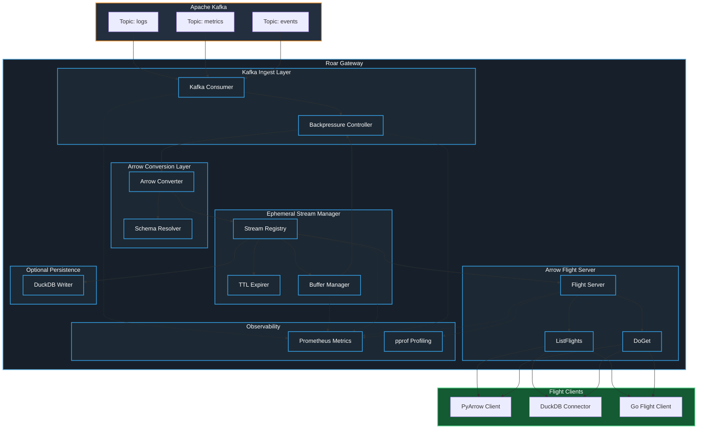

# 🦁 Roar

Roar is a high-performance Arrow Flight gateway for Apache Kafka. It consumes messages from Kafka topics, converts them to Apache Arrow RecordBatches, and exposes them as ephemeral Arrow Flight streams.

## Features

- **Real-time Kafka Ingestion**: Stream data directly from Kafka topics
- **Arrow Flight Integration**: Expose topics as Arrow Flight streams (using Arrow v18)
- **Ephemeral Streams**: Efficient memory management with TTL controls
- **Intelligent Back Pressure**: Built-in stream buffer management and memory monitoring
- **DuckDB Persistence**: Optionally persist streams to DuckDB tables
- **Prometheus Metrics**: Comprehensive metrics for monitoring stream health
- **Profiling Support**: Built-in pprof for performance analysis

## Installation

```bash
# Clone the repository
git clone https://github.com/TFMV/roar.git
cd roar

# Install dependencies
go mod tidy

# Build the binary
go build -o roar
```

## Quick Start

```bash
# Start the server with example topics
./roar serve --brokers localhost:9092 --topics logs,metrics --batch-size 1024 --ttl 60s --buffer-limit 100MB

# Check available topics
./roar client --server grpc://localhost:8080

# View data from a specific topic
./roar client --server grpc://localhost:8080 --topic logs --limit 10
```

## Usage

### Server

The `serve` command starts the Roar server:

```bash
./roar serve [flags]
```

#### Flags

| Flag | Description | Default |
|------|-------------|---------|
| `--brokers` | Kafka bootstrap servers | localhost:9092 |
| `--topics` | Comma-separated list of topics | (required) |
| `--schema-registry` | Avro/Protobuf schema registry URI | |
| `--batch-size` | Max records per RecordBatch | 1024 |
| `--ttl` | Stream TTL | 60s |
| `--buffer-limit` | Max in-memory bytes per stream | 100MB |
| `--port` | Arrow Flight server port | 8080 |
| `--persist` | Whether to write to DuckDB | false |
| `--db-path` | Path to DuckDB database file | roar.duckdb |
| `--metrics` | Enable Prometheus metrics | false |
| `--metrics-addr` | Metrics server address | :9090 |
| `--pprof` | Enable pprof profiling | false |
| `--pprof-addr` | Pprof server address | :6060 |

### Client

The `client` command allows you to connect to a Roar server and retrieve data:

```bash
./roar client [flags]
```

#### Flags

| Flag | Description | Default |
|------|-------------|---------|
| `--server` | Flight server address | grpc://localhost:8080 |
| `--topic` | Topic to fetch (if not specified, lists available topics) | |
| `--output` | Output format (table or csv) | table |
| `--limit` | Maximum number of rows to display | 10 |

## Architecture

Roar consists of several key components:

1. **Kafka Ingest Layer**: Consumes messages from Kafka topics using `segmentio/kafka-go`
2. **Arrow Conversion Layer**: Transforms messages into Arrow RecordBatches using Arrow v18
3. **Flight Gateway**: Serves Arrow data via the Flight protocol
4. **Stream Manager**: Manages ephemeral streams with TTL and memory limits
5. **Back Pressure System**: Monitors memory usage and applies back pressure when needed
6. **DuckDB Sink**: Optional persistence to DuckDB tables (v2 API compatible)



### Back Pressure Implementation

Roar implements sophisticated back pressure mechanisms to ensure stability under high load:

1. **Stream Buffer Control**: Each stream has a configurable maximum buffer size
2. **Memory-Aware Processing**: Tracks memory usage and slows down consumption when thresholds are reached
3. **Automatic Record Dropping**: Can optionally drop oldest records when buffers are full
4. **Metrics Exposure**: Comprehensive metrics exposed via Prometheus for monitoring

## Client Integration

### Python

```python
import pyarrow.flight as flight

# Connect to Roar server
client = flight.connect("grpc://localhost:8080")

# List available topics
for flight_info in client.list_flights():
    print(f"Topic: {flight_info.descriptor.path[0]}")

# Get data from a topic
descriptor = flight.FlightDescriptor.for_path("logs")
info = client.get_flight_info(descriptor)
reader = client.do_get(info.endpoints[0].ticket)

# Convert to pandas DataFrame
df = reader.read_all().to_pandas()
print(df)
```

### DuckDB

```sql
-- Install Arrow Flight extension
INSTALL 'arrow';
LOAD 'arrow';

-- Query Roar stream directly
SELECT * FROM arrow_flight_scan(
    'grpc://localhost:8080',
    'logs'
);
```

## Monitoring

When metrics are enabled, Roar exposes Prometheus-compatible metrics at `/metrics` on the configured metrics port.

Key metrics include:

- `roar_kafka_messages_total`: Total number of Kafka messages processed
- `roar_record_batches_created_total`: Total number of Arrow RecordBatches created
- `roar_active_streams`: Current number of active streams
- `roar_stream_memory_bytes`: Current memory usage by stream
- `roar_stream_memory_percent`: Percentage of maximum allowed memory used
- `roar_stream_buffer_utilization`: Percentage of maximum allowed buffer used
- `roar_stream_records_dropped_total`: Number of records dropped due to back pressure
- `roar_stream_records_processed_total`: Total number of records processed

## Performance Tuning

For optimal performance:

1. **Batch Size**: Adjust the `--batch-size` parameter based on your record size and memory constraints
2. **Buffer Limit**: Set the `--buffer-limit` to control memory usage per stream
3. **TTL**: Configure the `--ttl` to manage how long inactive streams stay in memory
4. **JVM Settings**: When using with Java clients, ensure enough heap space is allocated

## Profiling

When profiling is enabled, Roar exposes pprof endpoints at the configured pprof address (default: `:6060`).

Access profiles at:

- `http://localhost:6060/debug/pprof/`

## License

[MIT](LICENSE)
